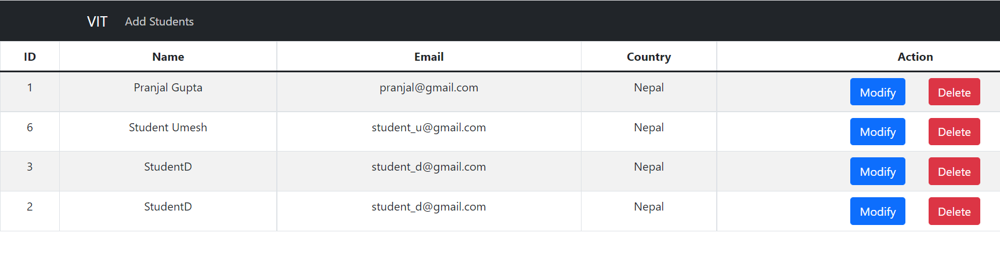
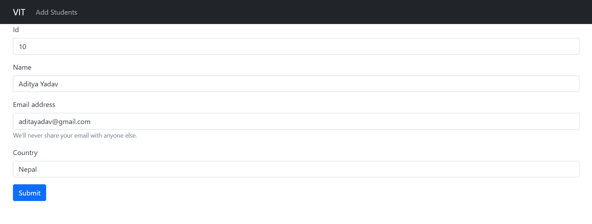
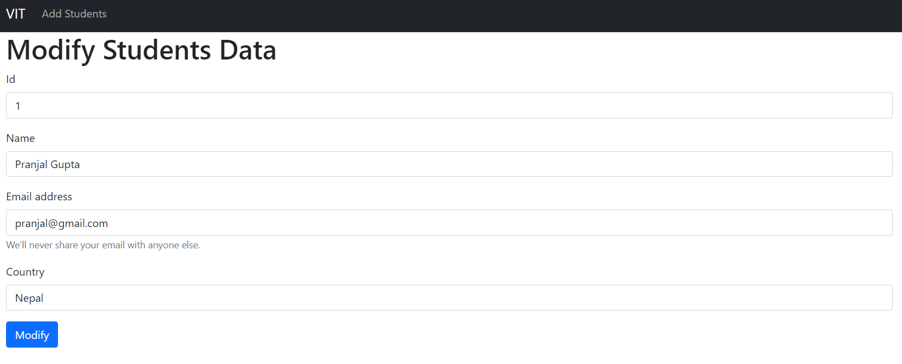

# Introduction

This project is made while learning axios. This is a simple react app to store students data. 
I have implemented CRUD operation in react using axios and local json-server.

# Home Page

# Add Students

# Modify Data

## To run the app in local machine, follow the commands below in root directory: 

### npm install

### npx json-server --watch .\studentDetails.json --port 3001
This will start running json server in port 3001.

### npm start
This will start the application in port 3000.